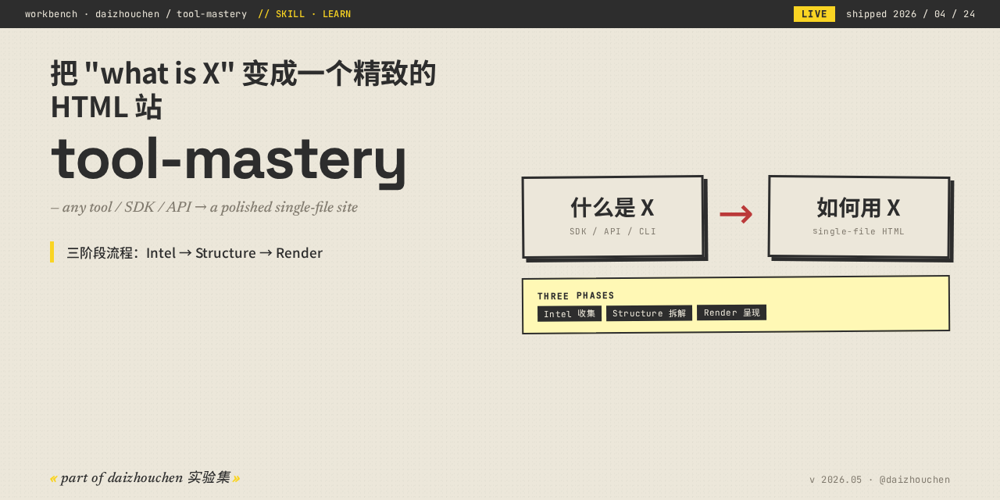

<!-- daizhouchen-banner-begin -->
<p align="center">
  
</p>

> **把 "what is X" 变成一个精致的 HTML 站。三阶段：Intel → Structure → Render。**
>
> *any tool / SDK / API → a polished single-file site.*
<!-- daizhouchen-banner-end -->

# tool-mastery

> A Claude skill that turns "what is X and how do I use it?" into a polished, single-file HTML site — without the Wikipedia bloat.


## What it does

Point Claude at a tool (or a combination of tools) and ask for a usage guide. The skill drives Claude through a disciplined three-phase workflow:

1. **Intel** — fetches current landing pages, docs, and GitHub READMEs via `WebFetch`. No memory-based facts.
2. **Structure** — shapes the findings into a JSON payload that matches a schema tuned for learning-by-doing: capabilities, quickstart, real scenarios, pitfalls, end-to-end workflows.
3. **Render** — pipes that JSON through a bundled Python script and an HTML template to emit a single self-contained page styled in a Linear/Vercel-inspired dark, minimal look.

The output is a file the user can open, save, print, or share with a new hire.

## Why bother

Most "explain this tool" outputs from LLMs are feature-list soup. This skill constrains Claude to produce:

- A quickstart that actually ends at "you've done something real"
- Scenarios named by outcome, not feature
- Pitfalls the docs' marketing page won't warn you about
- For multi-tool prompts: a joint workflow with a flow diagram — not three encyclopedia entries side by side

Visual consistency is enforced by the template, so no matter how many times the skill runs, the pages look like they belong to the same publication.

## Installation

### As a Claude Code skill

Clone into your Claude skills directory:

```bash
git clone https://github.com/<you>/tool-mastery.git ~/.claude/skills/tool-mastery
```

Claude Code picks up the skill automatically on next session.

### As a standalone tool

The renderer works without Claude — feed it a JSON file that matches `references/data-schema.md`:

```bash
python scripts/render.py my-data.json --output site.html
```

## Triggers

The skill description is tuned to fire on prompts like:

- "帮我介绍一下 Linear"
- "Claude Code 和 GitHub 怎么结合用"
- "integrate Notion with Slack, walk me through it"
- "give me a cheat sheet for kubectl"
- "I'm new to Terraform — make me an onboarding page"

It will **not** fire on debugging questions *inside* an already-adopted tool (e.g. "fix my Linear API call").

## Anatomy

```
tool-mastery/
├── SKILL.md                   # Instructions Claude follows
├── assets/
│   └── template.html          # Visual shell (CSS + layout)
├── scripts/
│   └── render.py              # JSON → HTML renderer
├── references/
│   └── data-schema.md         # Full JSON schema spec
└── evals/
    └── evals.json             # Test prompts used to develop the skill
```

## Data schema at a glance

```json
{
  "heroTitle": "...",
  "heroSubtitle": "...",
  "tools": [
    {
      "slug": "linear",
      "name": "Linear",
      "badge": "Issue tracker",
      "tagline": "...",
      "whatItIs": "...",
      "coreCapabilities": [{ "title": "...", "desc": "..." }],
      "quickStart": [{ "title": "...", "code": "..." }],
      "scenarios": [{ "title": "...", "goal": "...", "steps": ["..."] }],
      "pitfalls": [{ "label": "Don't", "text": "..." }],
      "docsUrl": "..."
    }
  ],
  "combos": [
    {
      "slug": "linear-github",
      "title": "Linear + GitHub",
      "tagline": "...",
      "overview": "...",
      "ascii": "Linear issue ──► GitHub PR ──► auto-close",
      "workflow": [
        { "tools": ["Linear", "GitHub"], "title": "...", "desc": "...", "code": "..." }
      ],
      "setup": [{ "title": "...", "desc": "..." }]
    }
  ]
}
```

See [`references/data-schema.md`](references/data-schema.md) for the full spec.

## Design decisions

| Question | Answer | Why |
|----------|--------|-----|
| Why three phases instead of one prompt? | Separates "what's true" (Intel) from "what matters" (Structure) from "what looks good" (Render). | Each phase can fail independently — easier to debug, easier to reuse. |
| Why a template instead of letting Claude write HTML? | Visual consistency across runs. | Hand-rolled HTML drifts in style every time. |
| Why `WebFetch` instead of trusting the model? | Tool docs change faster than training cutoffs. | Stale CLI flags and retired feature names are the #1 failure mode. |
| Why ban filler adjectives ("powerful", "seamless") in SKILL.md? | They don't transmit information. | The goal is onboarding, not marketing. |

## License

MIT. See [LICENSE](LICENSE).

## Acknowledgements

Built using the [Claude skill-creator](https://github.com/anthropics/skills) workflow.

---
<!-- daizhouchen-footer-begin -->

Part of [**daizhouchen 实验集**](https://github.com/daizhouchen) → 一个 AI 应用创造者的实验现场。
<!-- daizhouchen-footer-end -->
